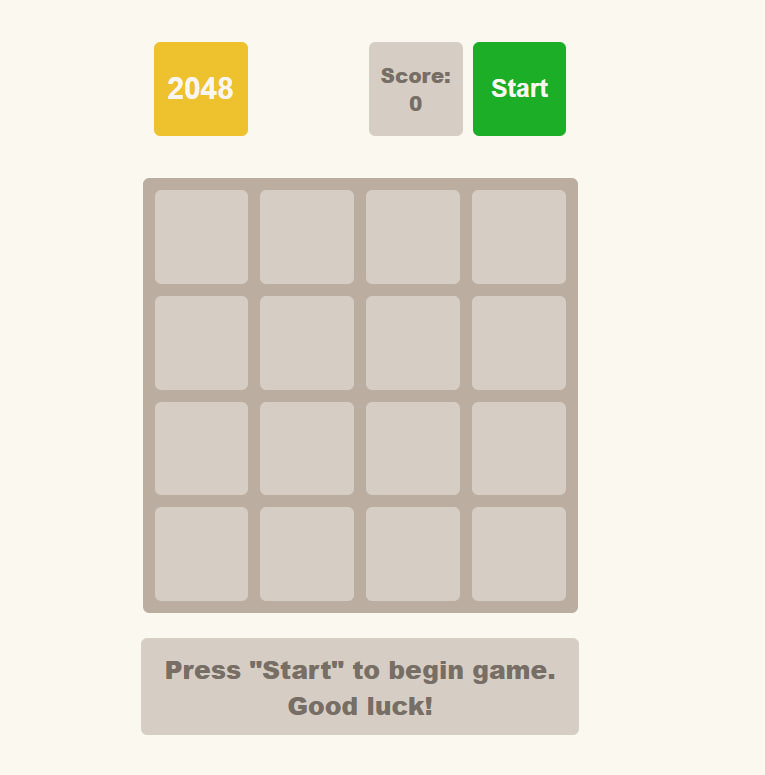
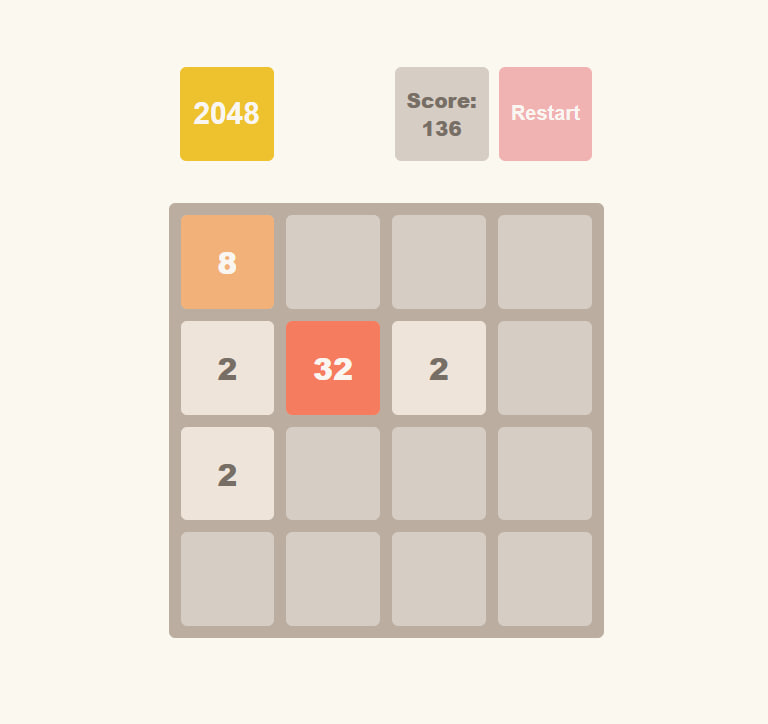
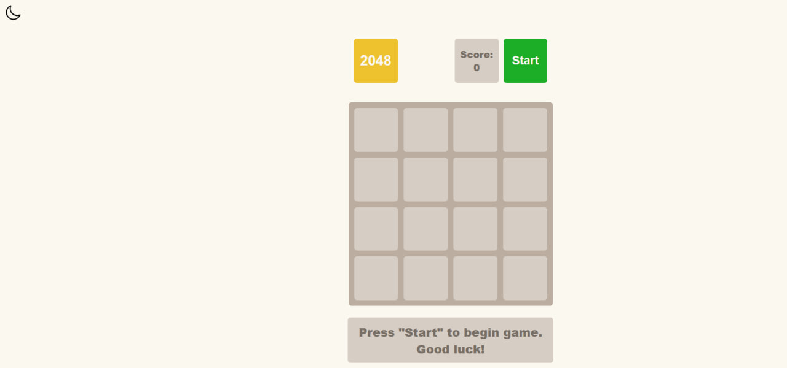
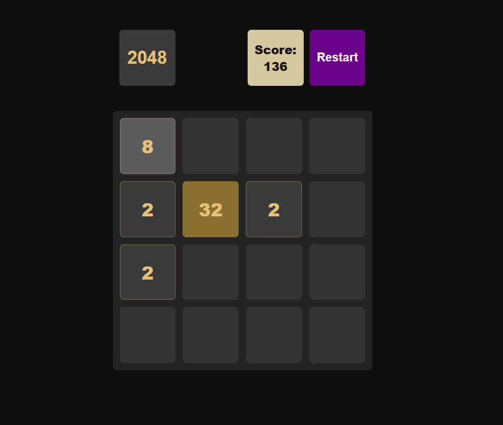

# 2048 Game

### Classic 2048 game implemented in vanilla JavaScript.

### Includes custom game logic, tile animations, and a dark mode designed by me.

---

### [DESIGN LINK](https://staner1.github.io/2048-game/) - click on the link to explore the game

---

### The list of technologies that were used:

 

- 
  HTML was used to build the semantic structure of the project

 

 

- 
  &nbsp;SCSS was used to enhance the styling process, and styles were compiled to CSS using Sass.

 

 

- 
  &nbsp;JavaScript was used to handle tile movement, score updates, and game state changes in the 2048 game.

 

---
### Instructions for Running the Project in a Local Repository

You need to have the following programs installed on your computer:

1. [Git](https://git-scm.com/downloads/win)  
2. [Node.js](https://nodejs.org/en/download/package-manager) (The version should be v20.xx.x)  
3. A code editor (for example, you can use [VSCode](https://code.visualstudio.com/docs/?dv=win))
   
### Further Actions:

- Fork the project repository on GitHub.

- Clone the project to your local computer.

- Open the project folder using a code editor.

- Open the project folder using a live server.

---

### Screenshots:

This is the initial state. Press "Start" to begin playing. Use the arrow keys (Up, Down, Left, Right) to move the tiles.

  

Press the button on the left side of the page to change the game color theme.

Dark mode